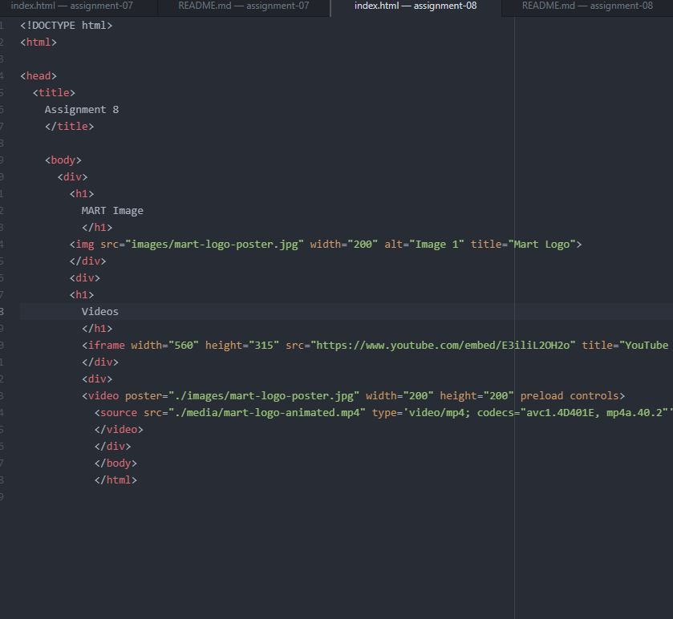

affordances are digital objects that we look at and immediately understand
what their use is and how to interact with them.
Advantage: No need for saving videos and loading them on the website, no need for hosting your own videos. Disadvantage is video could be taken off youtube, relying on other services is not ideal.
