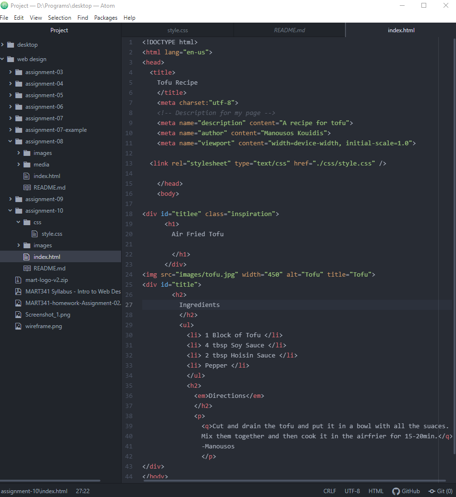

Describe the difference between the universal, element, class, and id selector types. When might you choose one over the other to style content?: All of them
are useful and each have their purpose. Universal is for everything, element is for stuff with the specific tag name, class is for elements but it doesnt affect the other elements on the page, and id helps match specific elements with specific values. Id use universal for background color, and the rest for more specific stuff like text format or text color.   

Discuss your color palette. How did you choose your colors?: I chose my colors
because they are similar colors to the food the recipe describes.
