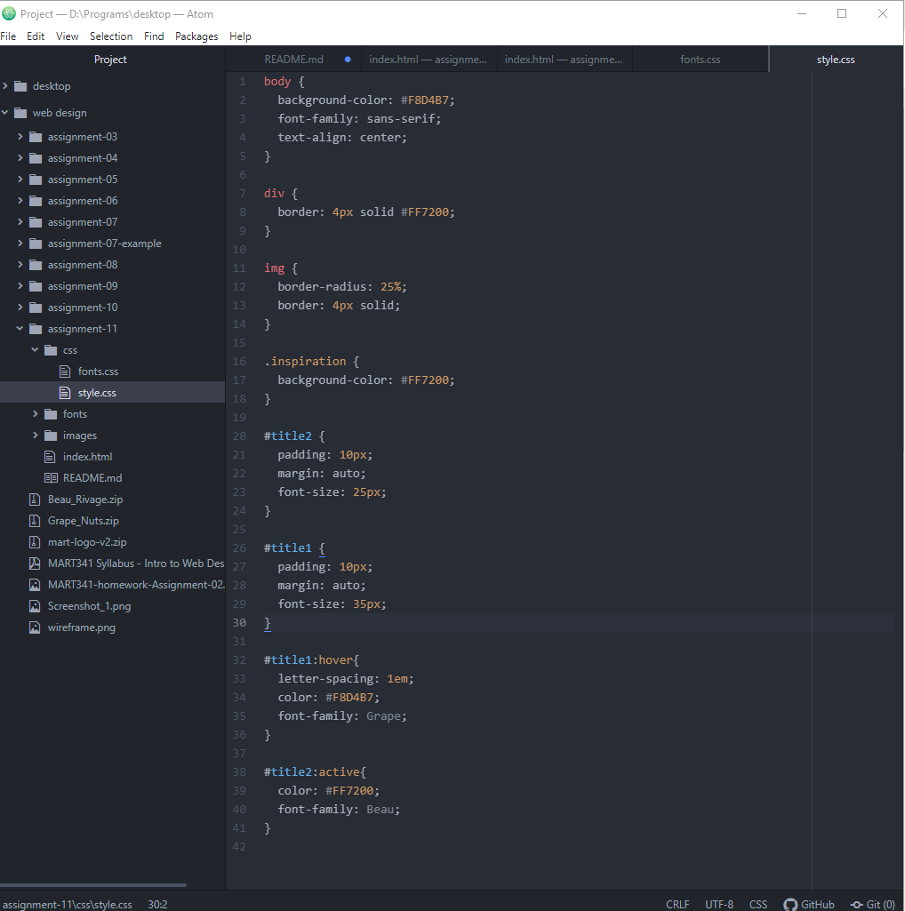

Typography is the art and technique of arranging type to make written language legible, readable, and appealing when displayed.
We need fallback fonts in case a system does not have the font we are using as part of its repertoire
system font is downloaded on your computer, web font can be downloaded on your browser or computer but not always, and web-safe font is always downloaded on your browser/computer and therefore it is safe
